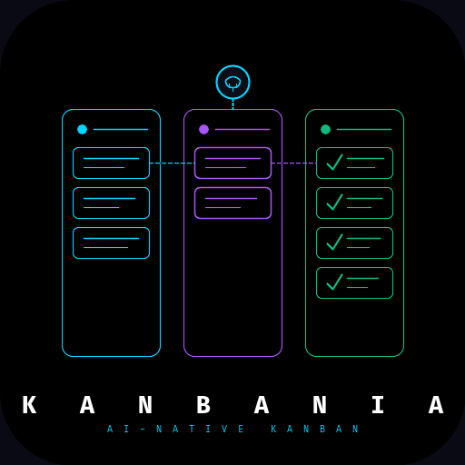
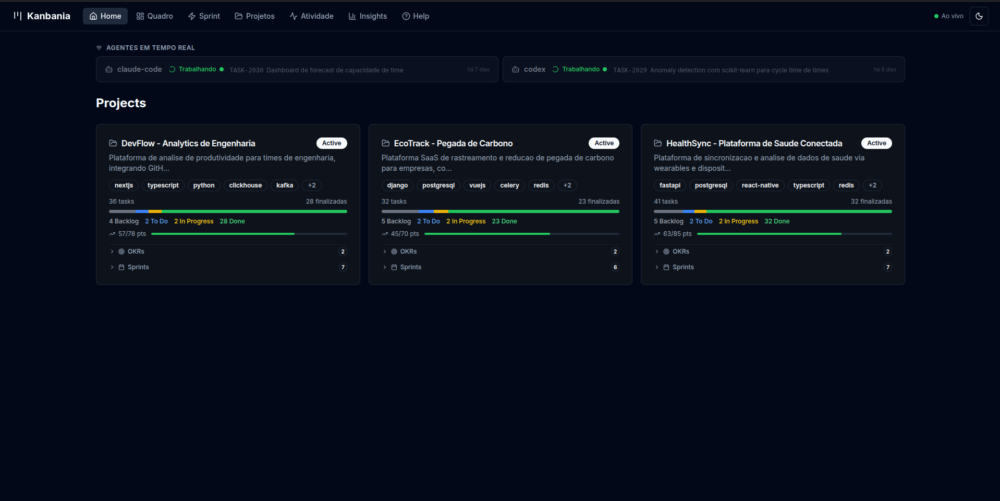

# Kanbania

<p align="center">
  
</p>

> AI-native kanban system — file-based, Git-versioned, multi-agent ready.

[](LICENSE)
[](https://www.npmjs.com/package/create-kanbania)
[](https://nodejs.org)
[](dashboard/)

Kanbania is a project management system designed to work alongside AI agents (Claude Code, Codex, Gemini, or any CLI-invokable AI). Board state lives in plain Markdown files committed to Git. Configuration is a single `config.yaml` — no database, no SaaS, no vendor lock-in.

## Install

```bash
npx create-kanbania my-project
```

That's it. The wizard sets up your workspace, installs the dashboard, and configures systemd services — all in one command.



## Features

- **File-based board** — every task is a Markdown file with YAML frontmatter
- **Git-versioned** — full audit trail, works with any git host
- **Multi-agent** — define multiple AI agents with roles (`implementer`, `reviewer`, `both`, `pm`)
- **Config-driven** — `config.yaml` controls columns, agents, workflows, and notifications
- **Real-time dashboard** — Next.js 14 app with live updates via WebSocket
- **Setup wizard** — `./setup.sh` gets you running in under 2 minutes
- **i18n templates** — agent instruction templates in English and Portuguese (pt-BR)

## Quickstart

```bash
npx create-kanbania my-project
cd my-project
```

The interactive wizard will ask for your name, timezone, and which agents to use. Optionally installs the dashboard and sets up systemd services so everything starts automatically on login.

**Non-interactive (CI/defaults):**
```bash
npx create-kanbania my-project --yes
```

## How It Works

```
board/
├── backlog/       ← identified tasks, awaiting prioritization
├── todo/          ← prioritized for current sprint
├── in-progress/   ← being worked on
├── review/        ← awaiting QA
└── done/          ← completed and approved
```

Each task is a Markdown file:

```markdown
---
id: TASK-0001
title: "Implement login form"
project: my-app
sprint: sprint-001
priority: high
story_points: 3
assigned_to: claude-code
review_requested_from: [codex]
---

## Description
...

## Acceptance Criteria
- [ ] Form validates email and password
- [ ] Error messages are shown inline
```

Board state changes are committed to Git automatically. `config.local.yaml` (gitignored) holds machine-specific paths.

## Agents

Define agents in `config.yaml`:

```yaml
agents:
  - id: "claude-code"
    name: "Claude Code"
    provider: "anthropic"
    role: "implementer"
    color: "#a855f7"
    exec_command: null        # null = manual trigger
    wip_limit: 2

  - id: "codex"
    name: "Codex"
    provider: "openai"
    role: "reviewer"
    color: "#22c55e"
    exec_command: "codex exec --full-auto -C {{working_dir}} --add-dir {{kanban_root}}"
    wip_limit: 1
```

Copy a template to your agent's config file:

```bash
cp templates/agents/en/implementer.md CLAUDE.md   # fill in {AGENT_ID} etc.
cp templates/agents/en/reviewer.md    CODEX.md
```

## Dashboard

```bash
cd dashboard
npm install
npm run build
KANBAN_ROOT=/path/to/kanbania PORT=8765 node .next/standalone/server.js
```

Open `http://localhost:8765`.

## Dependencies

| Dependency | Required for | Install |
|-----------|-------------|---------|
| bash 4.4+ | All scripts | pre-installed on Linux/macOS |
| [yq v4+](https://github.com/mikefarah/yq) | Config parsing | `snap install yq` or see yq releases |
| Node.js 18+ | Dashboard only | [nodejs.org](https://nodejs.org) |
| git 2.20+ | Board versioning | pre-installed |

## Documentation

- [AGENTS.md](AGENTS.md) — board workflow, task schema, agent roles
- [CONTRIBUTING.md](CONTRIBUTING.md) — how to contribute
- [CODE_OF_CONDUCT.md](CODE_OF_CONDUCT.md) — community standards
- [docs/](docs/) — additional documentation

## License

[MIT](LICENSE) — Copyright (c) 2025 Kanbania Contributors
